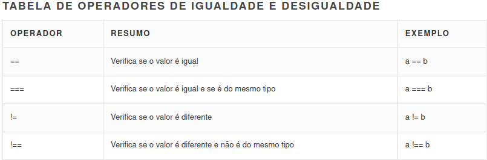
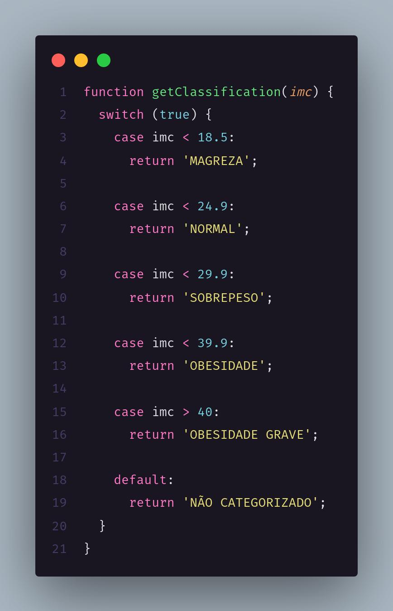

## Javascript

- Variáveis

  - Não tem tipagem estática, logo sua tipagem é dinâmica (uma variável pode receber diversos tipos de valores).
  - Para declarar utilizamos o "var"

```jsx
var variavel;
```

- principais tipos que a variável pode receber é: string, inteiro, float, booleano, vetor, objeto.

```jsx
var nome = "Gabriel Prando";
var idade = 20;
var peso = 70.4;
var estudante = true;

var tecnologia = ["javascript", "css", "html"];

var pessoa = {
  nome: "gabriel",
  idade: 20,
  peso: 70.4,
  estudante: true
}
```

- Funções

  - sintaxe

  ```jsx
  function name([param,[, param,[..., param]]]) {
     [statements]
  }
  ```

  `name`O nome da função.

  `param`O nome de um argumento a ser passado para a função. Uma função pode ter atè 255 argumentos.

  `statements`As instruções que compõem o corpo da função.

  ------

  - exemplo

```jsx
function sum(x, y){
    return x + y;
}

var result = sum(2+3);
console.log(result);
```

- Condicionais

  

  - If e else if são iguais a qualquer outra linguagens


```jsx
if ( condição ) {
	// Ação
} else if ( outra condição ) {
	// Ação
} else {
	// Ação final se nenhuma condição for verdadeira
}
```

- Switch case também é igual a outras linguagens

```jsx
var expr = 'Papayas';
switch (expr) {
  case 'Oranges':
    console.log('Oranges are $0.59 a pound.');
    break;
  case 'Mangoes':
  case 'Papayas':
    console.log('Mangoes and papayas are $2.79 a pound.');
    // expected output: "Mangoes and papayas are $2.79 a pound."
    break;
  default:
    console.log(`Sorry, we are out of ${expr}.`);
}
```



<!DOCTYPE html>
  <html lang="en">
<head>
      <title>Curso JavaScript</title>
</head>
  <body>

```html
  <script>
      function retornoSexo(sexo) {
        // M , F
          /*if(sexo === 'M'){
            return 'Masculino';
          }else if(sexo === 'F'){
            return 'Masculino';
          }else{
              return 'outro';
          }*/
  
          switch (sexo) {
              case 'M':
                return 'Masculino';
              case 'F':
                return 'Feminino';
              default:
                return  'outro';
          }
      }
      var resultado = retornoSexo('M');
      console.log(resultado);
  </script>
```

```html

- Operadores lógicos

  ```html
  <!DOCTYPE html>
  <html lang="en">
  <head>
      <title>Curso JavaScript</title>
  </head>
  <body>
      
      <script>
  
          // AND(&&) , OR (||), NOT (!==)
          var sexo = 'M', idade = 23;
  
          /*if (sexo === 'M' || idade >= 18){
              console.log('ok');
          }*/
  
          var masculino = sexo === 'M'; // true
          console.log(masculino);
  
      </script>
  </body>
  </html>
  
```

  

- Condição Ternária

```html

<!DOCTYPE html>
<html lang="en">
<head>
    <title>Curso JavaScript</title>
</head>
<body>
  
    <script>

        var sexo = 'M';

        var retorno = (sexo === 'M') ? 'Masculino' : 'Feminino';

        console.log(retorno);

    </script>
</body>
</html>
```


- Estrutura de repetição

  - FOR

    - Formado por três partes: inicialização, condição e incremento. A sintaxe é:

    ```jsx
    for (var i = 0; i <= 10; i++) {  //código a ser executado até a condição se tornar falsa}
    }
    ```

  - FOR IN

    - É utilizado quando não sabemos quantas vezes temos que iterar sobre um array ou objeto.

    ```jsx
    var arr = [1,2,3];
    for(var n in arr) {
      console.log(n);
    }
    ```

  - FOREACH

    - Utilizamos o `foreach` quando queremos percorrer as propriedades de um objeto ou os itens de um array, sem precisamos nos preocupar em contar quantos são.

    ```jsx
    var arr = [1,2,3];
    arr.forEach(function(each) {  
        console.log(each);
      }
    );
    ```

  - WHILE

    - Funciona basicamente igual ao for, e é possível sempre trocar o for() por um while(). Escolhemos um ou outro pela clareza do que estamos fazendo. Geralmente preferimos utilizar o loop for() para interar com contadores e loops while() até que alguma condição mude (de true para false, por exemplo).

    ```jsx
    var x = true;
    while(x) {  
        console.log('Jane Doe');  
        x = false;
    }
    ```

    - Nesse caso acima, o console.log será executado uma única vez, pois eu altero para false a variavel x, logo na primeira interação do laço. Mas eu poderia ter feito algo assim:

    ```jsx
    var i = 1,    x = 2; 
    while(x < 20) {  
      x = x + (x * i);   
      console.log('O valor atual de x é: ' + x);  
      i++;
    }
    ```

  - DO WHILE

    - Segue o mesmo princípio do while, mas o corpo é sempre executado pelo menos uma vez, independente da condição, pois primeiro ele faz **do** e depois testa a condição.

    ```jsx
    do {  
      console.log('Jane Doe');
    } while(false);
    ```

    - Apesar da condição já começar como falsa, veremos a string "Jane Doe" uma vez no console do browser.

- Manipulação de DOM

  - inline

  ```html
  // HTML
  <buttom> clique aqui </buttom>
  
  // JS
  var btn = document.querySelector('button');
  
  btn.onclick = function() {
    alert('olá mundo')
  }
  ```

  - Manipulando a dom

  ```jsx
  var btn = document.querySelector('button');
  
  function random(number) {
    return Math.floor(Math.random()*(number+1));
  }
  
  btn.onclick = function() {
    var rndCol = 'rgb(' + random(255) + ',' + random(255) + ',' + random(255) + ')';
    document.body.style.backgroundColor = rndCol;
  }
  ```

- Promises e requisições assíncronas

  - Uma *Promise* é um objeto em javascript usado para processamento assíncrono (como a nossa requisição) e possui duas funções principais, o *.then()* e o *.catch()*. O *.then()* é uma função de *callback* que dispõe do valor processado, já o *.catch()* é chamado somente se houver um erro inesperado.

  ```jsx
  fetch('<https://api.adviceslip.com/advice>')
  .then(function(response){
    console.log(response);
  })
  .catch(err){
    console.log(err)
  }
  ```

- Links e recomendações 
  - [Para iniciantes](https://tableless.github.io/iniciantes/manual/js/controles-de-fluxo-e-controles-de-repeticao.html)
  - [Laços e iterações](https://developer.mozilla.org/pt-BR/docs/Web/JavaScript/Guide/Lacos_e_iteracoes)